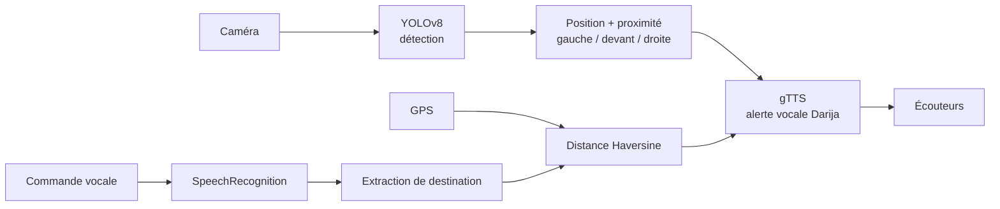

# 👓 Smart Glasses — Système intelligent de détection des obstacles pour personnes malvoyantes


Prototype de **lunettes intelligentes** qui aident une personne malvoyante à se déplacer :

- 🎯 **Détection d'obstacles** en temps réel avec **YOLOv8** (personnes, voitures, chaises, etc.)
- 📍 **Localisation spatiale** de chaque obstacle : *à gauche*, *devant*, *à droite*
- 📏 **Estimation de proximité** (loin / proche / très proche) à partir de la taille de la boîte
- 🔊 **Alertes vocales** en **Darija** (gTTS), avec anti-répétition
- 🧭 **Navigation vocale** : la personne dit sa destination (« bghit nmchi l ensias »), le système la guide selon la distance GPS restante

> ⚠️ **Prototype académique.** Ce système ne remplace ni la canne blanche, ni un chien guide, ni l'attention humaine. Ne pas l'utiliser comme seul moyen de sécurité.

## 🧠 Architecture



## 📁 Structure du projet

```
smart-glasses-blind-assist/
├── src/
│   ├── detector.py      # YOLOv8 + position spatiale + proximité
│   ├── audio.py         # synthèse vocale + traductions Darija + cooldown
│   ├── navigation.py    # destinations, GPS, distance, reconnaissance vocale
│   └── main.py          # CLI (detect / navigate)
├── notebooks/
│   └── coud_smat_Glasses.ipynb   # version Colab originale (prototype)
├── tests/
│   └── test_utils.py
├── requirements.txt
├── LICENSE
└── README.md
```

## 🚀 Installation

```bash
git clone https://github.com/<ton-username>/smart-glasses-blind-assist.git
cd smart-glasses-blind-assist

python -m venv .venv
source .venv/bin/activate        # Windows : .venv\Scripts\activate
pip install -r requirements.txt
```

Le modèle `yolov8n.pt` est téléchargé automatiquement par Ultralytics au premier lancement.

## ▶️ Utilisation

**Détection d'obstacles**

```bash
# Webcam, avec vidéo annotée
python -m src.main detect --source 0 --show

# Sur une image
python -m src.main detect --source data/image1.png

# Sans audio (debug)
python -m src.main detect --source 0 --mute
```

**Navigation vers une destination**

```bash
# Destination directe
python -m src.main navigate --destination ensias

# Depuis une commande vocale enregistrée
python -m src.main navigate --audio data/commande.wav
```

Destinations disponibles : `ensias`, `madinat al irfane`, `marjane hay riad`, `mosquee assounna` (modifiables dans `src/navigation.py`).

## 🧪 Tests

```bash
pytest -q
```

## 📓 Notebook

Le notebook `notebooks/coud_smat_Glasses.ipynb` contient la version Colab de départ (détection sur image, alertes audio, navigation simulée). Le code propre et réutilisable est dans `src/`.

## ⚠️ Limites connues

- Le **GPS est simulé** (`SimulatedGPS`) : à remplacer par un vrai module (téléphone, NEO-6M…).
- gTTS n'a **pas de voix Darija** : les alertes utilisent une translittération lue par la voix française, et les messages de navigation en écriture arabe utilisent la voix arabe (`lang="ar"`).
- gTTS et `recognize_google` nécessitent **une connexion Internet**.
- La proximité est une **estimation à partir de la taille de la boîte**, pas une vraie mesure de distance.
- Le modèle COCO pré-entraîné ne reconnaît pas les obstacles typiques du terrain (trottoirs, poteaux, trous, escaliers).

## 🛣️ Pistes d'amélioration

- [ ] Fine-tuning de YOLOv8 sur des obstacles urbains marocains (poteaux, trottoirs, escaliers)
- [ ] Capteur ultrasonique / LiDAR pour une vraie distance
- [ ] TTS hors-ligne (Piper, Coqui) et reconnaissance vocale Darija (Whisper)
- [ ] Déploiement embarqué (Raspberry Pi / Jetson Nano) avec export ONNX ou TensorRT
- [ ] Vrai GPS + itinéraires piétons (OSRM)
- [ ] Retour haptique (vibrations gauche / droite)

## 👩‍💻 Auteure

**Rkia** — Élève ingénieure en IA (2IA), ENSIAS, Université Mohammed V de Rabat.

## 📄 Licence

Distribué sous licence MIT — voir [LICENSE](LICENSE).
